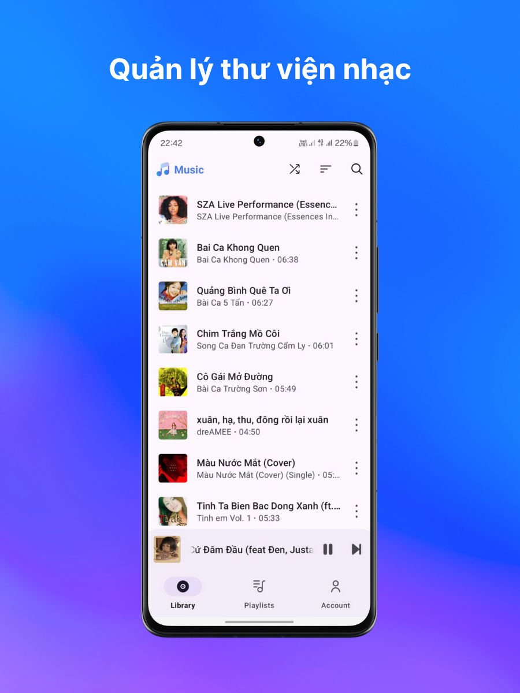
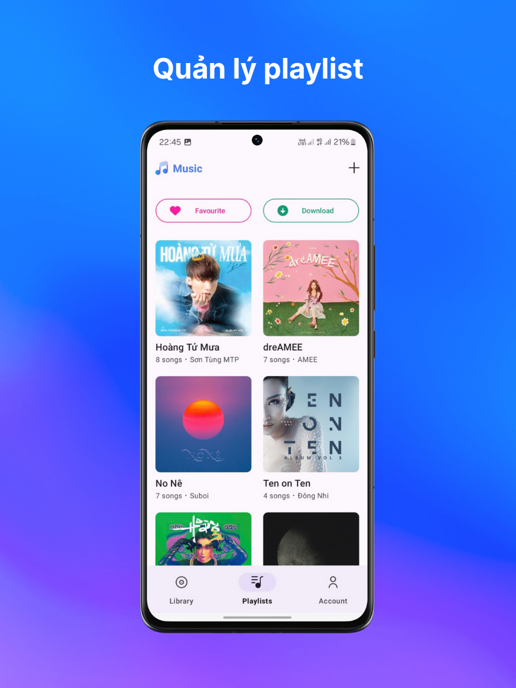
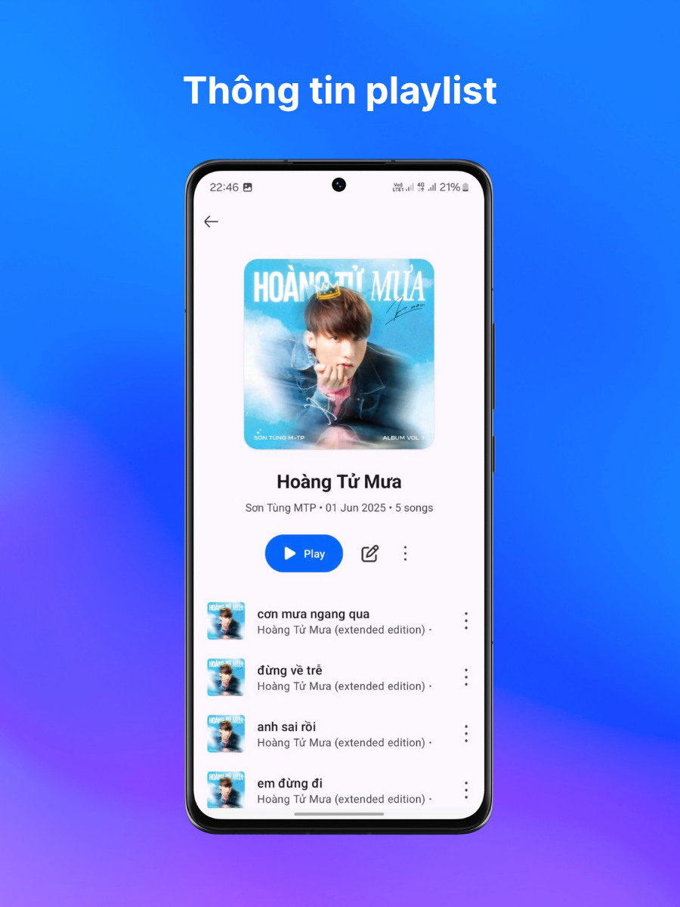
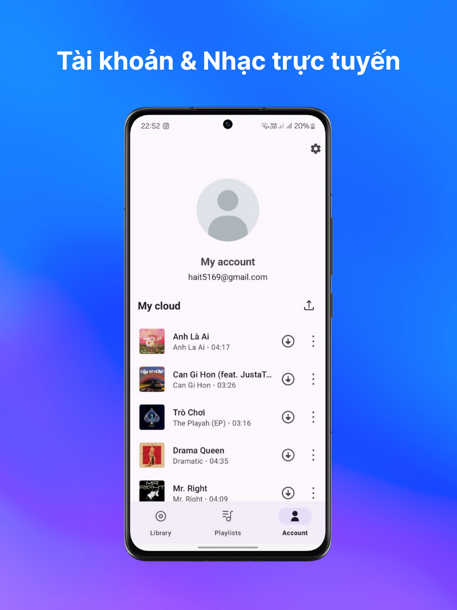
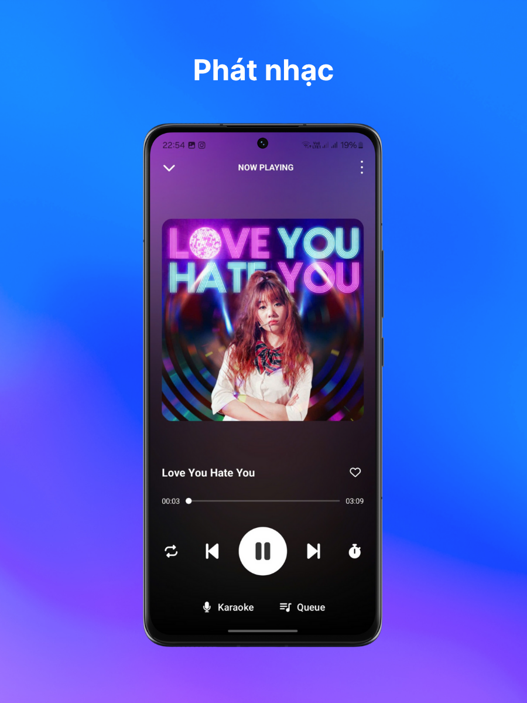
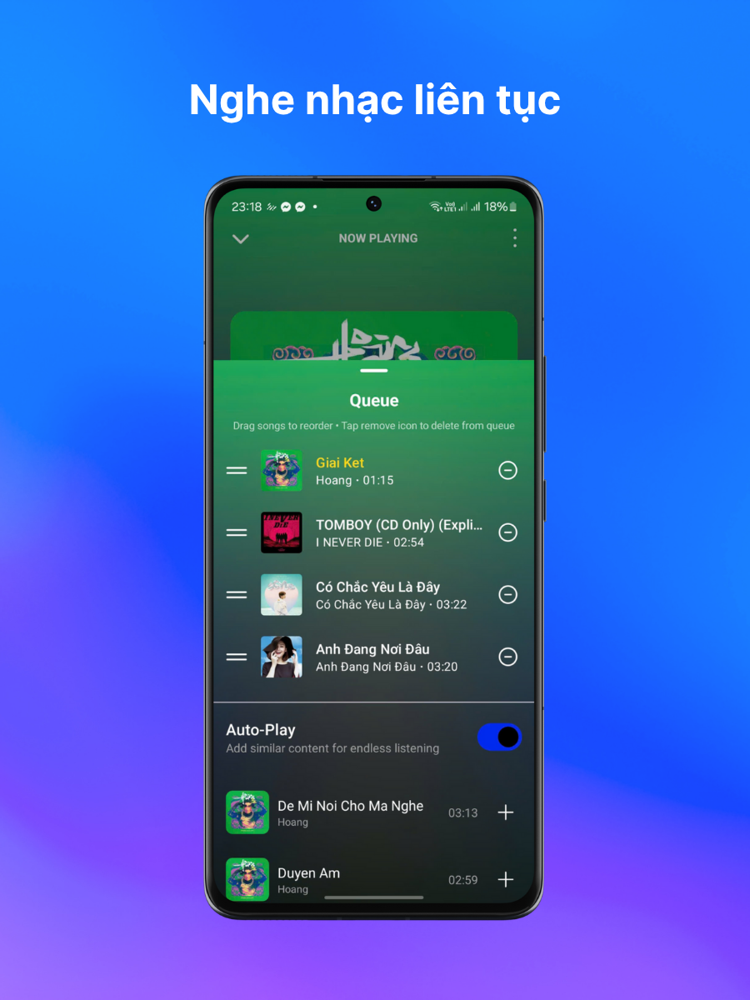
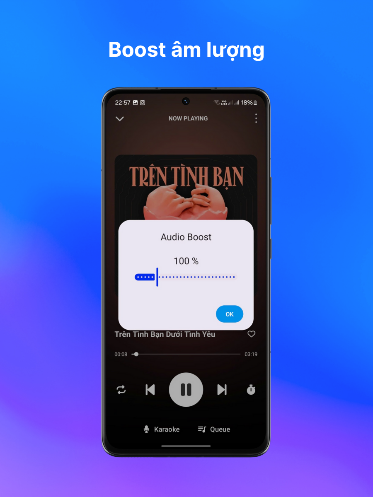

# 🎵 [Muzik Player] - Ứng dụng Nghe nhạc cho Android

Đây là một dự án ứng dụng nghe nhạc dành cho nền tảng Android, được xây dựng bằng **Kotlin**, sử dụng **Firebase** làm server để lưu trữ, quản lý các bài hát và cung cấp trải nghiệm nghe nhạc và hát cùng nhạc mới lạ.


## 😄 About us
- Khuất Tuấn Anh - 22028248
- Nguyễn Thị Huyền - 23020083
- Cao Chí Kiên - 22028065

## 📱 Giao diện ứng dụng

Dưới đây là một số ảnh chụp màn hình của ứng dụng:

| | |
|:---:|:---:|
|  |  |
|  |  |
|  |  |
|  |  |
  
## 📑 Mục lục

- [✨ Tính năng chính](#-tính-năng-chính)
- [💻 Công nghệ sử dụng](#-công-nghệ-sử-dụng)
- [🚀 Cài đặt và Sử dụng](#-cài-đặt-và-sử-dụng)
  - [Tải và cài đặt qua file APK](#1-tải-và-cài-đặt-qua-file-apk)
  - [Tải và cài đặt qua Android Studio](#2-tải-và-cài-đặt-sử-dụng-android-studio)
- [🔧 Cấu hình Firebase](#-cấu-hình-firebase)

## ✨ Tính năng chính

- Phát nhạc từ danh sách có sẵn.
- Điều khiển nhạc: Phát, Dừng, Tiếp theo, Trước đó.
- Giao diện người dùng thân thiện, dễ sử dụng.
- Hiển thị thông tin bài hát: Tên, Ca sĩ, Ảnh bìa.
- Tìm kiếm bài hát.
- Equalizer, chỉnh âm lượng độc lập thiết bị
- Hát karaoke
- Nghe nhạc online
- Upload và Download nhạc chung trên server

## 💻 Công nghệ sử dụng

- **Ngôn ngữ**: Kotlin  
- **UI**: XML, Material Design  
- Server lưu trữ: Firebase

## 🚀 Cài đặt và Sử dụng

Có hai cách để bạn trải nghiệm ứng dụng:

### 1. Tải và cài đặt qua file APK 
- Tải file `.apk` mới nhất từ link sau:  
  🔗 [LINK TẢI FILE APK CỦA BẠN]

- Mở file `.apk` trên điện thoại Android của bạn.
- Cho phép cài đặt từ "Nguồn không xác định" nếu được yêu cầu.
- Làm theo hướng dẫn để hoàn tất cài đặt và mở ứng dụng.

### 2. Tải và cài đặt sử dụng Android Studio

**Yêu cầu:**

- Android Studio (phiên bản mới nhất)
- Git đã được cài đặt

**Các bước thực hiện:**

```bash
git clone https://github.com/nstpvcpiooi/android-music-player
```


- Mở Android Studio** > `File -> Open` > trỏ tới thư mục vừa clone về.
- Chờ Gradle sync hoàn tất.
- Cấu hình Firebase** (xem phần bên dưới 🔧).
- Kết nối thiết bị Android
- Nhấn nút Run** (hoặc `Shift + F10`) để build và chạy ứng dụng.

## 🔧 Cấu hình Firebase
### 🔨 Bước 1: Tạo Project Firebase

1. Truy cập vào [Firebase Console](https://console.firebase.google.com/).
2. Đăng nhập bằng tài khoản Google của bạn.
3. Nhấn **"Tạo dự án"** (hoặc **"Get started with a Firebase project"**).
4. Đặt tên cho project, ví dụ: `AndroidMusicPlayer`.
5. Nhấn **"Continue"** và làm theo hướng dẫn để hoàn tất quá trình khởi tạo.

### 🤝 Bước 2: Tích hợp Firebase vào Android Studio

#### ✅ Thêm Firebase vào project

- Mở Android Studio.
- Chọn `Tools > Firebase`.
- Chọn các dịch vụ bạn muốn sử dụng như:
  - **Authentication**
  - **Realtime Database**
- Nhấn vào **"Connect to Firebase"** để kết nối với project đã tạo trên Firebase Console.
- Tiếp theo, nhấn **"Add [service] to your app"** để thêm các dependency cần thiết (Android Studio sẽ tự động chỉnh sửa file `build.gradle`).

> ⚠️ Đảm bảo bạn đang sử dụng **Kotlin** nếu dự án của bạn dùng Kotlin.

### 🧪 Bước 3: Kiểm tra kết nối

- Vào Firebase Console:
  - Chọn mục **Authentication** hoặc **Realtime Database**.
  - Kiểm tra xem có dữ liệu nào xuất hiện từ ứng dụng sau khi chạy thử không.

- Mở ứng dụng trên **thiết bị thật hoặc emulator**:
  - Thực hiện hành động như đăng nhập, ghi dữ liệu.
  - Kiểm tra xem Firebase Console có nhận dữ liệu hay chưa.

✅ Nếu thấy dữ liệu phản hồi, chứng tỏ ứng dụng đã kết nối Firebase thành công!

## Enjoy our app 👍

